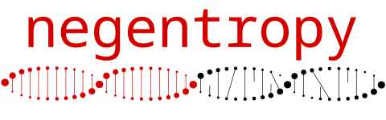
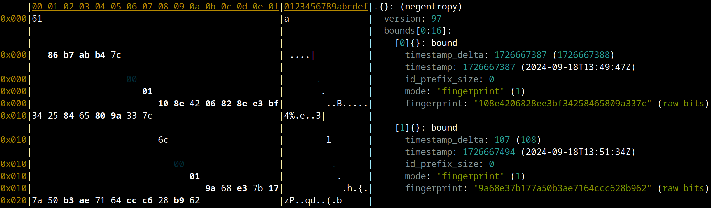

This repo contains the protocol specification, reference implementations, and tests for the negentropy set-reconciliation protocol. See [our article](https://logperiodic.com/rbsr.html) for a detailed description.

<!-- TOC FOLLOWS -->
<!-- START OF TOC -->
<!-- DO NOT EDIT! Auto-generated by md-toc: https://github.com/hoytech/md-toc -->

* [Introduction](#introduction)
* [Protocol](#protocol)
    * [Data Requirements](#data-requirements)
    * [Setup](#setup)
    * [Bounds](#bounds)
    * [Fingerprints](#fingerprints)
    * [Alternating Messages](#alternating-messages)
    * [Algorithm](#algorithm)
    * [Frame Size Limits](#frame-size-limits)
* [Definitions](#definitions)
    * [Varint](#varint)
    * [Bound](#bound)
    * [Range](#range)
    * [Message](#message)
* [Implementations](#implementations)
* [Misc](#misc)
    * [Protocol Debugging with fq](#protocol-debugging-with-fq)
* [Testing](#testing)
* [Applications](#applications)
* [Author](#author)

<!-- END OF TOC -->

## Introduction

Set-reconciliation supports the replication or syncing of data-sets, either because they were created independently, or because they have drifted out of sync due to downtime, network partitions, misconfigurations, etc. In the latter case, detecting and fixing these inconsistencies is sometimes called [anti-entropy repair](https://docs.datastax.com/en/cassandra-oss/3.x/cassandra/operations/opsRepairNodesManualRepair.html).

Suppose two participants on a network each have a set of records that they have collected independently. Set-reconciliation efficiently determines which records one side has that the other side doesn't, and vice versa. After the records that are missing have been determined, this information can be used to transfer the missing data items. The actual transfer is external to the negentropy protocol.

Negentropy is based on Aljoscha Meyer's work on "Range-Based Set Reconciliation" ([overview](https://github.com/AljoschaMeyer/set-reconciliation) / [paper](https://arxiv.org/abs/2212.13567) / [master's thesis](https://github.com/AljoschaMeyer/master_thesis/blob/main/main.pdf)).

This page is a technical description of the negentropy wire protocol and the various implementations. Read [our article](https://logperiodic.com/rbsr.html) for a comprehensive introduction to range-based set reconciliation.

## Protocol

### Data Requirements

In order to use negentropy, you need to define some mappings from your data records:

* `record -> ID`
  * Typically a cryptographic hash of the entire record
  * The ID must be 32 bytes in length
  * Different records should not have the same ID (satisfied by using a cryptographic hash)
  * Equivalent records should not have different IDs (records should be canonicalised prior to hashing, if necessary)
* `record -> timestamp`
  * Although timestamp is the most obvious, any ordering criteria can be used. The protocol will be most efficient if records with similar timestamps are often downloaded/stored/generated together
  * Units can be anything (seconds, microseconds, etc) as long as they fit in an 64-bit unsigned integer
  * The largest 64-bit unsigned integer should be reserved as a special "infinity" value
  * Timestamps do **not** need to be unique (different records can have the same timestamp). If necessary, `0` can be used as the timestamp for every record

Negentropy does not support the concept of updating or changing a record while preserving its ID. This should instead be modelled as deleting the old record and inserting a new one.

### Setup

The two parties engaged in the protocol are called the client and the server. The client is also called the *initiator*, because it creates and sends the first message in the protocol.

Each party should begin by sorting their records in ascending order by timestamp. If the timestamps are equivalent, records should be sorted lexically by their IDs. This sorted array and contiguous slices of it are called *ranges*.

For the purpose of this specification, we will assume that records are always stored in arrays. However, implementations may provide more advanced storage data-structures such as trees.

### Bounds

Because each side potentially has a different set of records, ranges cannot be referred to by their indices in one side's sorted array. Instead, they are specified by lower and upper *bounds*. A bound is a timestamp and a variable-length ID prefix. In order to reduce the sizes of reconciliation messages, ID prefixes are as short as possible while still being able to separate records from their predecessors in the sorted array. If two adjacent records have different timestamps, then the prefix for a bound between them is empty.

Lower bounds are *inclusive* and upper bounds are *exclusive*, as is [typical in computer science](https://www.cs.utexas.edu/users/EWD/transcriptions/EWD08xx/EWD831.html). This means that given two adjacent ranges, the upper bound of the first is equal to the lower bound of the second. In order for a range to have full coverage over the universe of possible timestamps/IDs, the lower bound would have a 0 timestamp and all-0s ID, and the upper-bound would be the specially reserved "infinity" timestamp (max u64), and the ID doesn't matter.

### Fingerprints

The *fingerprint* of a range is computed with the following algorithm:

* Compute the addition mod `2**256` of the element IDs (interpreted as 32-byte little-endian unsigned integers)
* Concatenate with the number of elements in the range, encoded as a [variable-length integer](#varint)
* Hash with SHA-256
* Take the first 16 bytes

### Alternating Messages

After both sides have setup their sorted arrays, the client creates an initial message and sends it to the server. The server will then reply with another message, and the two parties continue exchanging messages until the protocol terminates (see below). After the protocol terminates, the *client* will have determined what IDs it has (and the server needs) and which it needs (and the server has). If desired, it can then respectively upload and/or download the missing records.

Each message consists of a protocol version byte followed by an ordered sequence of ranges. Each range contains an upper bound, a mode, and a payload. The range's implied lower bound is the same as the previous range's upper bound (or 0, if it is the first range). The mode indicates what type of processing is needed for this range, and therefore how the payload should be parsed.

The modes supported are:

* `Skip`: No further processing is needed for this range. Payload is empty.
* `Fingerprint`: Payload contains the fingerprint for this range.
* `IdList`: Payload contains a complete list of IDs for this range.

If a message does not end in a range with an "infinity" upper bound, an implicit range with upper bound of "infinity" and mode `Skip` is appended. This means that an empty message indicates that all ranges have been processed and the sender believes the protocol can now terminate.

### Algorithm

Upon receiving a message, the recipient should loop over the message's ranges in order, while concurrently constructing a new message. `Skip` ranges are answered with `Skip` ranges, and adjacent `Skip` ranges should be coalesced into a single `Skip` range.

`IdList` ranges represent a complete list of IDs held by the sender. Because the receiver obviously knows the items it has, this information is enough to fully reconcile the range. Therefore, when the client receives an `IdList` range, it should reply with a `Skip` range. However, since the goal of the protocol is to ensure the *client* has this information, when a server receives an `IdList` range it should reply with its own ranges (typically `IdList` and/or skip ranges).

`Fingerprint` ranges contain enough information to determine whether or not the set of data items within the range are equal on each side, however determining the actual difference in IDs requires further recursive processing.
  * Since `IdList` or `Skip` messages will always cause the client to terminate processing for the given ranges, these messages are considered *base cases*.
  * When the fingerprints on each side differ, the reciever should *split* its own range and send the results back in the next message. When splitting, the number of records within each sub-range should be considered. If small, an `IdList` range should be sent. If large, the sub-ranges should themselves be sent as `Fingerprint`s (this is the recursion).
  * When a range is split, the sub-ranges should completely cover the original range's lower and upper bounds.
  * Unlike in Meyer's designs, an "empty" fingerprint is never sent to indicate the absence of items within a range. Instead, an `IdList` of length 0 is sent because it is smaller.
  * How to split the range is implementation-defined. The simplest way is to divide the records that fall within the range into N equal-sized buckets, and emit a `Fingerprint` sub-range for each of these buckets. However, an implementation could choose different grouping criteria. For example, events with similar timestamps could be grouped into a single bucket. If the implementation believes recent events are less likely to be reconciled, it could make the most recent bucket an `IdList` instead of `Fingerprint`.
  * Note that if alternate grouping strategies are used, an implementation should never reply to a range with a single `Fingerprint` range, otherwise the protocol may never terminate (if the other side does the same).

The initial message should cover the full universe, and therefore must have at least one range. The last range's upper bound should have the infinity timestamp (and the `id` doesn't matter, so should be empty also). How many ranges used in the initial message depends on the implementation. The most obvious implementation is to use the same logic as described above, either using the base case or splitting, depending on set size. However, an implementation may choose to use fewer or more buckets in its initial message, and/or may use different grouping strategies.

Once the client has looped over all ranges in a server's message and its constructed response message is a full-universe `Skip` range (ie, the empty string `""`), then it needs no more information from the server and therefore it should terminate the protocol.

### Frame Size Limits

If there are too many differences and/or they are too evenly distributed throughout the range, then message sizes may become unmanageably large. This might be undesirable if the network transport has message size limitations, meaning you would have to implement some kind of fragmentation system. Furthermore, large batch sizes inhibit work pipelining, where the synchronised records can be processed in parallel with additional reconciliation.

Because of this, negentropy implementations may support a *frame size limit* parameter. If configured, all messages created by this instance will be of length equal to or smaller than this number of bytes. After processing each message, any discovered differences will be included in the `have`/`need` arrays on the client.

To implement this, instead of sending all the ranges it has found that need syncing, the instance will send a smaller number of them to stay under the size limit. Any following ranges that were sent are replied to with a single coalesced `Fingerprint` range so that they will be processed in subsequent message rounds. Frame size limits can increase the number of messaging round-trips and bandwidth consumed.

In some circumstances, already processed ranges can be coalesced into the final `Fingerprint` range. This means that these ranges will get re-processed in subsequent reconciliation rounds. As a result, if either of the two sync parties use frame size limits, then discovered differences may be added to the `have`/`need` multiple times. Applications that cannot handle duplicates should track the reported items to avoid processing items multiple times.

## Definitions

### Varint

Varints (variable-sized integers) are a format for serialising unsigned integers into a small number of bytes. They are stored as base 128 digits, most significant digit first, with as few digits as possible. Bit eight (the high bit) is set on each byte except the last.

    Varint := <Digit+128>* <Digit>

### Bound

The protocol relies on bounds to group ranges of data items. Each range is specified by an *inclusive* lower bound, followed by an *exclusive* upper bound. As noted above, only upper bounds are transmitted (the lower bound of a range is the upper bound of the previous range, or 0 for the first range).

Each encoded bound consists of an encoded timestamp and a variable-length disambiguating prefix of an event ID (in case multiple items have the same timestamp):

    Bound := <encodedTimestamp (Varint)> <length (Varint)> <idPrefix (Byte)>*

* The timestamp is encoded specially. The "infinity timestamp" (such that all valid items precede it) is encoded as `0`. All other values are encoded as `1 + offset`, where offset is the difference between this timestamp and the previously encoded timestamp. The initial offset starts at `0` and resets at the beginning of each message.

  Offsets are always non-negative since the upper bound's timestamp is always `>=` to the lower bound's timestamp, ranges in a message are always encoded in ascending order, and ranges never overlap.

* The size of `idPrefix` is encoded in `length`, and can be between `0` and `32` bytes, inclusive. Efficient implementations will use the shortest possible prefix needed to separate the first record of this range from the last record of the previous range. If these records' timestamps differ, then the length should be 0, otherwise it should be the byte-length of their common ID-prefix plus 1.

  If the `idPrefix` length is less than `32` then the omitted trailing bytes are considered to be 0 bytes.

### Range

IDs are represented as byte-strings of length `32`:

    Id := Byte{32}

A range consists of an upper bound, a mode, and a payload (determined by mode):

    Range := <upperBound (Bound)> <mode (Varint)> <payload (Skip | Fingerprint | IdList)>

* If `mode = 0`, then payload is `Skip`, which is simply empty:

      Skip :=

* If `mode = 1`, then payload is `Fingerprint`, the [fingerprint](#fingerprints) of all the IDs in this range:

      Fingerprint := Byte{16}

* If `mode = 2`, the payload is `IdList`, a variable-length list of all IDs within this range:

      IdList := <length (Varint)> <ids (Id)>*

### Message

A reconciliation message is a protocol version byte followed by an ordered list of ranges:

    Message := <protocolVersion (Byte)> <Range>*

* Zero ranges represents an implicit `Skip` over the full universe of IDs.
* The current protocol version is 1, represented by the byte `0x61`. Protocol version 2 will be `0x62`, and so forth.
* If a server (non-initiator) receives a messages with a protocol version that it cannot handle, it should reply with a single byte containing the highest protocol version it can.

## Implementations

This section lists all the currently-known negentropy implementations. If you know of a new one, please let us know by [opening an issue](https://github.com/hoytech/negentropy/issues/new).

| **Language** | **Author** | **Status** | **Storage** |
| ---- | ---- | ---- | ---- |
| [C++](cpp/README.md) | reference | Stable | Vector, BTreeMem, BTreeLMDB, SubRange |
| [Javascript](js/README.md) | reference | Stable | Vector |
| [Rust](https://github.com/yukibtc/rust-negentropy) | Yuki Kishimoto | Stable | Vector |
| [Go](https://github.com/illuzen/go-negentropy) | Illuzen | Stable | Vector |
| [C bindings](c/README.md) | DarshanBPatel | Experimental | Same as C++ |

## Misc

### Protocol Debugging with fq

fiatjaf added support to [fq](https://github.com/wader/fq) to inspect and debug negentropy messages (see [example usage](https://github.com/wader/fq/blob/master/doc/formats.md#negentropy)):

## Testing

There is a conformance test-suite available in the `testing` directory.

In order to test a new language you should create a "harness", which is a basic stdio line-based adapter for your implementation. See the [test/cpp/harness.cpp](test/cpp/harness.cpp) and [test/js/harness.js](test/js/harness.js) files for examples. Next, edit the file `test/Utils.pm` and configure how your harness should be invoked.

Harnesses may require some setup before they are usable. For example, to use the C++ harness you must first run:

    git submodule update --init
    cd test/cpp/
    make

In order to run the test-suite, you'll need the perl module [Session::Token](https://metacpan.org/pod/Session::Token) (`libsession-token-perl` Debian/Ubuntu package).

Once setup, you should be able to run something like `perl test.pl cpp,js` from the `test/` directory. This will perform the following:

* For each combination of language run the following fuzz tests:
  * Client has all records
  * Server has all records
  * Both have all records
  * Client is missing some and server is missing some

The test is repeated using each language as both the client and the server.

Afterwards, a different fuzz test is run for each language in isolation, and the exact protocol output is stored for each language. These are compared to ensure they are byte-wise identical.

Finally, a protocol upgrade test is run for each language to ensure that when run as a server it correctly indicates to the client when it cannot handle a specific protocol version.

* For the Rust implementation, check out its repo in the same directory as the `negentropy` repo, build the `harness` commands for both C++ and Rust, and then inside `negentropy/test/` directory running `perl test.pl cpp,rust`

* For the golang implementation, checkout the repo in the same directory as the `negentropy` repo, then inside `negentropy/test/` directory running `perl test.pl cpp,go`

## Applications

This section lists the currently-known production applications that use negentropy. If you know of a new one, please let us know by [opening an issue](https://github.com/hoytech/negentropy/issues/new).

* [Bandwidth-efficient Nostr event syncing](https://github.com/hoytech/strfry/blob/next/docs/negentropy.md)

## Author

(C) 2023-2024 Doug Hoyte and contributors

Protocol specification, reference implementations, and tests are MIT licensed.

Negentropy is a [Log Periodic](https://logperiodic.com) project.

See [our article](https://logperiodic.com/rbsr.html) for more information.
